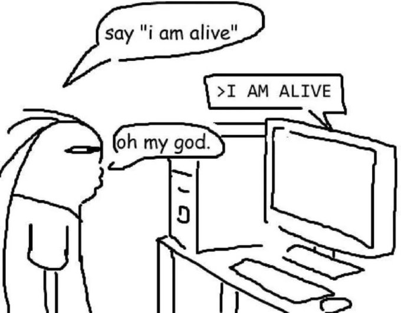

  

  

I build small, sharp tools for the web. TypeScript and JavaScript mostly, React when it needs a UI, Python when it is the fastest path to done. Currently studying Computer Science.

  

### Toolbox

  

  

  

  

  

  

  

  

  

  

